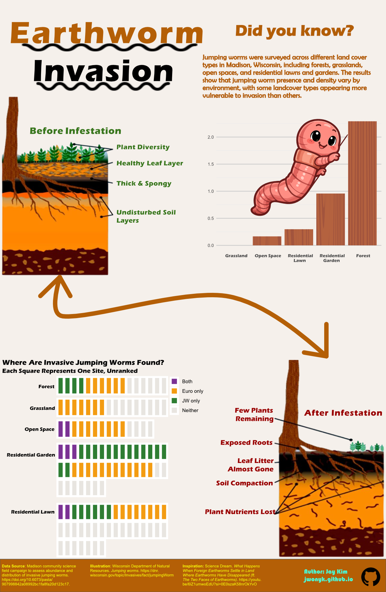
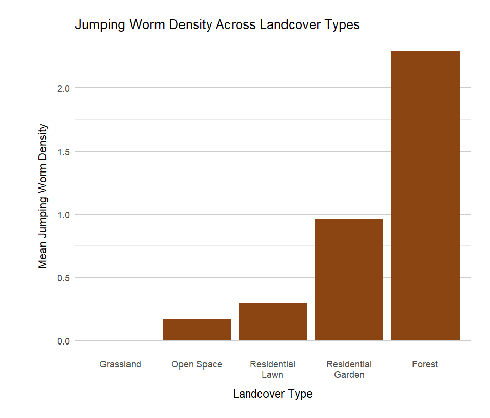
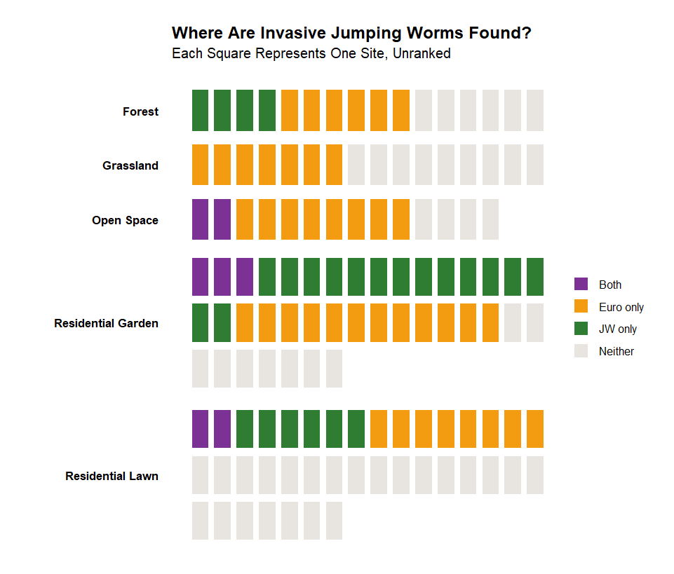

## When Earthworms Become Invaders

Growing up in South Korea, I often watched documentaries and historical dramas that described earthworms as almost like magical helpers of the soil. Worms were seen as quiet workers that turned dry, dusty land into rich soil where crops could grow. In many cultures, earthworms are symbols of healthy land because they break down organic matter and help nutrients move through the soil.

Because of this, I always thought of earthworms as helpful creatures.

But while working with ecological data for this project, I learned that not all earthworms are beneficial everywhere. In parts of North America, Asian jumping worms are actually invasive species that can damage ecosystems. Instead of improving soil, they can strip away the leaf litter layer that forests depend on, leaving the soil compact and exposed.

This discovery made me curious: Where are jumping worms most common in urban environments? And how might different types of land cover affect their presence?

To explore these questions, I used a dataset from a community science sampling event conducted in Madison, Wisconsin, in 2017. During this event, volunteers collected data on jumping worm presence and abundance across several types of urban landscapes, including forests, grasslands, open spaces, residential lawns, and residential gardens. My goal was to turn this data into a clear infographic that explains where jumping worms appear and why their spread matters for ecosystems.

Below is the final infographic summarizing what I found.

## Infographic

{fig-align="center"}

This infographic has been worked initial plotting with R `ggplot` package, `Google Slides`, and `Affinity`.

## Designing the Infographic

My infographic combines several different visual elements to explain both the science behind jumping worm invasions and the data collected from the Madison field study. I focused on keeping the visuals simple, readable, and engaging so that people without a science background could still understand the story. I included a before-and-after ecological illustration by educational graphics used in conservation outreach by Wisconsin Asian Earth Worm information page. This image shows how forest soil looks before infestation (rich leaf litter, plant diversity, and healthy soil layers), and how it changes after jumping worms invade, with exposed roots and compacted soil.

### Graphic Form and Data Visualizations

The infographic includes three main visualizations.

The first chart shows the mean jumping worm density across different land cover types. I used a simple bar chart because it clearly shows differences between categories. The chart reveals that forest sites had the highest jumping worm density, followed by residential gardens, while grasslands and open spaces had much lower densities.

{fig-align="center"}

The second visualization is a waffle-style grid showing where invasive jumping worms and European earthworms were found across sites. Each square represents a sampling location, and the colors indicate whether jumping worms, European worms, both, or neither were observed. This helps show that some landscapes may host multiple worm types, while others remain relatively unaffected.



Together, these visuals show both the ecological consequences and the spatial patterns of the invasion.

## Color, Layout, and Visual Storytelling

I chose warm brown and earthy colors to reflect the theme of soil and forests. The bar chart uses a wood texture to visually connect the data to forest ecosystems. I also kept the background light and neutral so that the main graphics would stand out clearly.

To guide the reader through the infographic, I added curved arrows and a cartoon worm illustration. These elements help guide the reader’s eye from the introduction to the data visualization and, finally, to the ecological impact section. This flow helps tell a story rather than presenting disconnected charts.

I also focused on text hierarchy. Large titles introduce each section, while smaller explanatory text provides additional context for readers who want more detail.

## Learning Moments

One of the most interesting parts of this project was realizing how something usually seen as beneficial, earthworms, can become harmful when introduced to a new environment. Invasive species often disrupt ecosystems in unexpected ways, and visualizing data can help make those impacts easier to understand.

Designing the infographic also showed me how important it is to balance scientific accuracy with clear storytelling. While the data set contains many variables, I focused on the visuals that most clearly explained the main message: jumping worm invasions vary across landscapes and can significantly alter forest ecosystems.

By combining data visualization with ecological illustration, I hoped to create an infographic that is both informative and engaging for a broad audience.

## Plot Code

```{r}
#| code-fold: true
#| message: false
#| warning: false
#| eval: false
#| echo: true

# Packages
library(tidyverse)
library(here)
library(janitor)
library(waffle)
library(ggh4x)
library(sf)
library(tigris)
library(ggplot2)

# --------------------------
# Load + Clean Data
# --------------------------

# Load data
worms_raw <- read_csv(here("data", "EDI_Data_Metadata_JumpingWorms.csv")) %>%
  clean_names()

# Clean data
worms <- worms_raw %>%
  mutate(site_id = as.character(site_id),
         landcover_type = str_to_title(landcover),
         
         # Fix inconsistent land cover labels
         landcover_type = recode(landcover_type,
                                 "Residential_lawn" = "Residential Lawn",
                                 "Residential_garden" = "Residential Garden"),


    # Jumping worm presence (YES/NO -> TRUE/FALSE)
    jw_present = case_when(
      jumping_worm_presence %in% c("YES", "Yes", "yes") ~ TRUE,
      jumping_worm_presence %in% c("NO",  "No",  "no")  ~ FALSE,
      TRUE ~ NA),

    # European worm presence across any of the 3 pours (YES/NO -> TRUE/FALSE)
    euro_present = case_when(
      pour1_european_earthworm_presence %in% c("YES","Yes","yes") |
        pour2_european_earthworm_presence %in% c("YES","Yes","yes") |
        pour3_european_earthworm_presence %in% c("YES","Yes","yes") ~ TRUE,
      pour1_european_earthworm_presence %in% c("NO","No","no") &
        pour2_european_earthworm_presence %in% c("NO","No","no") &
        pour3_european_earthworm_presence %in% c("NO","No","no") ~ FALSE,
      TRUE ~ NA),

    # Mean density across the three pours (invasion intensity metric)
    mean_density_3pours = rowMeans(cbind(pour1_density, 
                                         pour2_density, 
                                         pour3_density), 
                                   na.rm = TRUE),
    mean_density_3pours = if_else(is.nan(mean_density_3pours), 
                                  NA_real_, mean_density_3pours),

    # Total jumping worm abundance across species columns
    total_worm_count = rowSums(
      cbind(abundance_tok, abundance_agr, abundance_unk, abundance_mh),
      na.rm = TRUE))

# --------------------------
# Plot 1 — Mean density by Land Cover (low -> high)
# --------------------------

# Summarize mean jumping worm density per habitat, ordered low to high
density_by_landcover <- worms %>%
  filter(!is.na(mean_density_3pours), !is.na(landcover_type)) %>%
  group_by(landcover_type) %>%
  summarize(
    mean_density = mean(mean_density_3pours, na.rm = TRUE),
    n_sites = n(),
    .groups = "drop") %>%
  arrange(mean_density)

# Bar chart of mean density by habitat
p_density <- ggplot(
  density_by_landcover,
  aes(x = reorder(landcover_type, mean_density), y = mean_density)) +
  geom_col(fill = "#8B4513") +
  labs(title = "Jumping Worm Density Across Landcover Types", 
       x = "Landcover Type",
       y = "Mean Jumping Worm Density") +
  scale_x_discrete(labels = scales::label_wrap(12)) +
  theme_minimal(base_size = 12) +
  theme(plot.title = element_text(just = 0.5),
        axis.text.x = element_text(size = 10, hjust = 0.5),
        axis.title.x = element_text(margin = margin(t = 10)),
        axis.title.y = element_text(margin = margin(r = 10)),
        plot.margin = margin(t = 20, r = 20, b = 20, l = 40),
        panel.grid.major.x = element_blank(),
        panel.grid.minor.x = element_blank(),
        panel.grid.major.y = element_line(color = "grey80"))

p_density

# --------------------------
# Plot 2 — Donut chart: share of sites invaded (NA removed)
# --------------------------

# Calculate percentage of sites with jumping worms present vs. not
invasion_share <- worms %>%
  filter(!is.na(jw_present)) %>%
  count(jw_present) %>%
  mutate(pct = 100 * n / sum(n),
         site_status = if_else(jw_present, "Invaded", "Not invaded")) %>%
  select(site_status, n, pct)

# Donut chart showing invaded vs. not-invaded site proportions
p_invaded <- ggplot(invasion_share, aes(x = 2, y = pct, 
                                        fill = site_status)) +
  geom_col(color = "white") +
  coord_polar(theta = "y") +
  xlim(0.5, 2.5) +
  theme_void() +
  labs(fill = "Site Status",
       title = "Proportion of Sites Invaded by Jumping Worms") +
  theme(legend.position = "right",
        plot.title = element_text(size = 13, face = "bold",
                                  margin = margin(b = 4)),
        plot.margin = margin(t = 20, r = 20, b = 20, l = 40))

p_invaded

# --------------------------
# Plot 3A — Stack Bar
# --------------------------

# Co-occurrence categories
coexistence <- worms %>%
  filter(!is.na(jw_present), !is.na(euro_present), !is.na(landcover_type)) %>%
  mutate(worm_status = 
           case_when(jw_present & euro_present ~ "Both present",
                     jw_present & !euro_present ~ "Jumping worms only",
                     !jw_present & euro_present ~ "European worms only",
                     TRUE ~ "Neither")) %>%
  count(landcover_type, worm_status) %>%
  group_by(landcover_type) %>%
  mutate(pct = 100 * n / sum(n)) %>%
  ungroup()

p_species <- ggplot(coexistence, aes(x = landcover_type, y = pct, 
                                     fill = worm_status)) +
  geom_col() +
  scale_x_discrete(labels = scales::label_wrap(12)) +
  labs(x = "Landcover Type",
       y = "Share of Sites (%)",
       fill = "Worm Presence") +
  theme_minimal(base_size = 12) +
  
  theme(plot.title = element_blank(),
        axis.text.x = element_text(size = 10, hjust = 0.5))

p_species

# --------------------------
# Plot 3B — Waffle Bar
# --------------------------

# One row per site with worm status counts coded by habitat
sites <- bind_rows(
  tibble(landcover = "Forest", 
         status = c(rep("Both", 0), rep("JW only", 4), 
                    rep("Euro only", 6), rep("Neither", 6))),
  tibble(landcover = "Grassland", 
         status = c(rep("Both", 0), rep("JW only", 0), 
                    rep("Euro only", 7), rep("Neither", 9))),
  tibble(landcover = "Open Space",
         status = c(rep("Both", 2), rep("JW only", 0), 
                    rep("Euro only", 8), rep("Neither", 4))),
  tibble(landcover = "Residential Garden", 
         status = c(rep("Both", 3), rep("JW only", 15),
                    rep("Euro only", 12),rep("Neither", 9))),
  tibble(landcover = "Residential Lawn",
         status = c(rep("Both", 2), rep("JW only", 6), 
                    rep("Euro only", 8), rep("Neither", 23)))) %>%
  mutate(landcover = factor(landcover, # Set display order of habitats
                            levels = c("Forest",
                                       "Grassland",
                                       "Open Space",
                                       "Residential Garden",
                                       "Residential Lawn"))) %>%
  group_by(landcover) %>%
  mutate(col = (row_number() - 1) %% 16,  # Wrapping at 16 cols
         row = (row_number() - 1) %/% 16) %>%
  ungroup()

# Compute panel heights - tiles stay square across habitats with different row n
panel_heights <- sites %>%
  group_by(landcover) %>%
  summarise(nrows = max(row) + 1) %>%
  pull(nrows)

# Plot waffle chart with one facet per habitat, sized proportionally
ggplot(sites, aes(x = col, y = -row, fill = status)) +
  geom_tile(colour = "white", linewidth = 1.5, 
            width = 0.9, height = 0.9) +
  facet_wrap(~landcover, ncol = 1, 
             strip.position = "left", scales = "free_y") +
  force_panelsizes(rows = panel_heights) +
  scale_fill_manual(values = c(
    "Both"      = "#7B3294",
    "JW only"   = "#2E7D32",
    "Euro only" = "#F39C12",
    "Neither"   = "#E8E5E0")) +
  labs(title = "Where Are Invasive Jumping Worms Found?",
       subtitle = "Each Square Represents One Site, Unranked") +
  theme_void() +
  theme(plot.title = element_text(size = 13, face = "bold",
                                  margin = margin(b = 4)),
        plot.subtitle = element_text(size = 11,
                                     margin = margin(b = 20)),  
    strip.text.y.left = element_text(angle = 0, hjust = 1.0, 
                                     vjust = 0.5, size = 9,
                                     face = "bold", 
                                     margin = margin(r = 8)),
    legend.title      = element_blank(),
    legend.position   = "right",
    strip.placement = "outside",
    panel.spacing     = unit(0.3, "lines"),
    plot.margin = margin(t = 20, r = 20, b = 20, l = 40))

# --------------------------
# Plot 4 — Map
# --------------------------

# Get Wisconsin state and Madison city boundaries
options(tigris_use_cache = TRUE)
wisconsin <- states(cb = TRUE) %>% 
  filter(NAME == "Wisconsin")
madison <- places(state = "WI", cb = TRUE) %>% 
  filter(NAME == "Madison")

# Plot
ggplot() +
  geom_sf(data = wisconsin, fill = NA, 
          color = "#555555", linewidth = 0.8) +
  geom_sf(data = madison, fill = "#F0EDE8", 
          color = "#C0392B", linewidth = 0.6) +
  theme_void()

# Get Madison centroid for label placement
madison_centroid <- st_centroid(madison) %>% 
  st_coordinates()

# Add annotation for Madison
ggplot() +
  geom_sf(data = wisconsin, fill = NA, 
          color = "#555555", linewidth = 0.8) +
  geom_sf(data = madison,   fill = "#F0EDE8", 
          color = "#C0392B", linewidth = 0.6) +
 annotate("text",
           x = madison_centroid[1] + 0.6,
           y = madison_centroid[2] + 0.45,
           label = "Madison, WI\nStudy Sites",
           size = 3.5,
           color = "#333333",
           hjust = 0,
           family = "sans") +
  geom_curve(
    aes(x = madison_centroid[1] + 0.55,
        y = madison_centroid[2] + 0.35,
        xend = madison_centroid[1] + 0.05,
        yend = madison_centroid[2] + 0.05),
    curvature = -0.3, # controls bend
    arrow = arrow(length = unit(0.2, "cm"), type = "closed"),
    color = "#555555",
    linewidth = 1.1) +
  theme_void() +
  labs(title = "Study Site: Madison, Wisconsin")
```

## Reference

Wisconsin Department of Natural Resources. 2026. *Jumping Worms Fact Sheet*. Retrieved: March 6th, 2026, https://dnr.wisconsin.gov/topic/Invasives/fact/jumpingWorm.

Ziter, C.D., B.M. Herrick, M.R. Johnston, and M.G. Turner. 2022. *Madison community science field campaign to assess abundance and distribution of invasive jumping worms*. Environmental Data Initiative. Retrieved: March 6th, 2026, https://doi.org/10.6073/pasta/907998842a08992bc1fa8fa20d123c17
